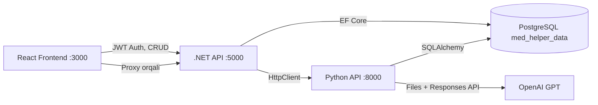

# NMED EKG Tahlili App — Constitution

## Project Overview

**NMED** — tibbiy tahlil platformasi (EKG, Laboratoriya, Holter, SMAD). Loyiha uch qatlamdan iborat:
- **Backend (.NET 8 / C#)** — CRUD, autentifikatsiya, avtorizatsiya, ma'lumotlar bazasi
- **Frontend (React 18)** — foydalanuvchi interfeysi, shifokor kabineti
- **AI/Scripting (Python FastAPI)** — EKG signal tahlili, AI diagnostika (OpenAI GPT)

---

## Core Principles

### I. Shared Database Architecture (MUHIM)
Backend (.NET) va Python (FastAPI) **bitta PostgreSQL bazaga** (`med_helper_data`) ulanadi.
- **Baza sxemasi** `.NET Entity Framework Migrations` tomonidan boshqariladi. Python tomoni `SQLAlchemy` orqali faqat yozish/o'qish qiladi.
- **Jadval nomlari** snake_case: `ecg_analyses`, `lab_analyses`, `holter_analyses`, `smad_analyses`, `medical_diagnoses`, `ecg_analyse_doctors`, `ecg_analyse_complaints` va h.k.
- **Yangi jadval qo'shish** faqat .NET Migrations orqali amalga oshiriladi. Python `models.py` faqat mavjud jadvallarni reflect qiladi.
- **Ustun nomlari** snake_case va ikkala tomonda identik bo'lishi shart: `patcient_id`, `created_doctor_id`, `clinic_id`, `status`, `ai_answer_data`, `analyse_file_link`, `generated_file_link`, va hokazo.

### II. Dual-Backend Architecture
Ikki alohida backend mavjud, har biri o'z vazifasini bajaradi:

| Qatlam | Texnologiya | Port | Vazifa |
|--------|-------------|------|--------|
| **.NET API** | ASP.NET Core 8 | `5000` (HTTP), `5001` (HTTPS) | CRUD, Auth (JWT), foydalanuvchi/klinika/shifokor/bemor boshqaruvi |
| **Python API** | FastAPI + Uvicorn | `8000` | EKG signal parsing, AI tahlil (OpenAI), Lab/Holter/SMAD tahlil |

- Frontend `.NET API` ga autentifikatsiyadagi va CRUD so'rovlarini yuboradi.
- Frontend `Python API` ga to'g'ridan-to'g'ri AI tahlil so'rovlarini yuboradi (token tekshirish yo'q!).
- Ikkala backend bir-biri bilan bevosita so'zlashmaydi — faqat baza orqali. Python natijalarni bazaga yozadi, .NET ularni o'qib frontendga qaytaradi.

### III. Frontend Architecture
- **Framework**: React 18, Create React App (react-scripts)
- **State Management**: Zustand (yagona `Store.js`)
- **HTTP Client**: Axios — ikki alohida baseURL:
  - `.NET API` → `axiosInstance` interceptor bilan (JWT token boshqaruvi)
  - `Python API` → oddiy `axios` (autentifikatsiyasiz)
- **UI Library**: Ant Design (antd)
- **Routing**: react-router-dom v7
- **i18n**: react-i18next (uz, ru, en tillari)
- **Auth**: `js-cookie` orqali `NMED_token` saqlanadi

### IV. API Contract Rules
Python endpointlari:
- `POST /api/analyze` — EKG fayl tahlili (XML/CSV/PNG → AI natija)
- `POST /api/analyze-save` — EKG faylni faqat saqlash (AI tahlilsiz)
- `POST /api/analyze-retry` — Mavjud tahlilni qayta yuborish
- `POST /api/med-diagnoses-save` — Tibbiy tashxis faylini saqlash
- `POST /lab/analyze` — Laboratoriya tahlili
- `POST /lab/analyze-save` — Lab faylini saqlash
- `POST /holter/analyze` — Holter tahlili
- `POST /smad/analyze` — SMAD tahlili

.NET endpointlari:
- `api/auth/*` — register, login, verify, change-password
- `api/ecg-analyses/*` — ECG CRUD
- `api/lab-analyses/*` — Lab CRUD
- `api/holter-analyses/*`, `api/smad-analyses/*`
- `api/doctors/*`, `api/patcients/*`, `api/clinics/*`, `api/regions/*`

### V. AI Integration Protocol
- **Provider**: OpenAI (GPT-5.2 modeli — Python, GPT-4o — .NET fallback)
- **Flow**: Frontend → Python API → OpenAI Files API → OpenAI Responses API → JSON javob → bazaga saqlash
- **Prompt tili**: O'zbek tilida professional kardiologiya terminlari
- **Javob formati**: Qat'iy JSON schema (`digital_measurements`, `automatic_analysis`, `automatic_analysis_bool`, `AI_recommendations`, `final_summary`)
- **API kalitlari** hozirda hardcoded (⚠️ xavfsizlik muammosi — kelajakda `.env` ga o'tkazilishi lozim)

---

## Technology Stack Constraints

### Backend (.NET)
- **.NET 8**, EF Core 7 + Npgsql
- JWT autentifikatsiya (`Microsoft.AspNetCore.Authentication.JwtBearer`)
- BCrypt parol hashlash
- MailKit email jonatish
- iTextSharp PDF generatsiya
- Rate Limiting (1 daqiqada 5 marta — `strict` policy)
- CORS: `http://localhost:3000`, `https://nmed.uz`
- Swagger UI (faqat Development muhitda)

### Python
- FastAPI + Uvicorn
- SQLAlchemy + psycopg2 (PostgreSQL)
- NeuroKit2 — EKG signal processing
- NumPy, SciPy, Pandas — raqamli tahlil
- Matplotlib — EKG grafik rendering
- Pillow — rasm boshqaruvi
- OpenAI Python SDK
- fuzzywuzzy — lead nomi mos kelishi

### Frontend
- React 18, react-scripts (CRA)
- Zustand, Axios, Ant Design
- react-router-dom v7, react-i18next
- chart.js + react-chartjs-2
- js-cookie, react-input-mask, cleave.js

---

## Development Workflow

### File Organization Rules
```
backend/EkgAnalyzerApi/
  ├── Controllers/     # API endpointlar (Controller per entity)
  ├── Services/        # Biznes logika
  ├── Models/          # EF Core entity modellari (snake_case table mapping)
  ├── DTOs/            # Request/Response DTO'lar
  ├── Data/            # DbContext (MedDataDB)
  ├── Migrations/      # EF Core migratsiyalar (baza sxemasi manba haqqoniyati)
  └── Program.cs       # DI, middleware, konfiguratsiya

python_back/
  ├── main.py          # Asosiy FastAPI app + EKG endpointlar
  ├── models.py        # SQLAlchemy modellari (bazadagi jadvallar reflect)
  ├── database.py      # DB connection
  ├── *_analyse.py     # CRUD helper'lar (create/update)
  ├── *_analyses_api.py # FastAPI Router submodulelar
  └── requirements.txt # Python dependencies

frontend/src/
  ├── host/            # API konfiguratsiya (Host.js, Api.js, *Service.js)
  ├── host/requests/   # Entity-based API request funksiyalari
  ├── store/           # Zustand global store
  ├── pages/           # Sahifalar (auth/, cabinet/)
  ├── components/      # Qayta ishlatiladigan komponentlar
  ├── locale/          # i18n tarjimalar
  └── App.js           # Root komponent
```

### Code Conventions
1. **Naming**:
   - C#: PascalCase (class, method), camelCase (local vars)
   - Python: snake_case (func, var), PascalCase (class)
   - React: PascalCase (components), camelCase (functions, state vars)
   - DB columns: snake_case
2. **Error Handling**:
   - .NET: try-catch + `BadRequest`/`Unauthorized` response
   - Python: try-except + `HTTPException` yoki `JSONResponse(content={error})`
   - Frontend: try-catch + console.log (TODO: foydalanuvchiga xabar berish)
3. **Status Codes** (ECG/Lab/Holter/SMAD tahlillari):
   - `0` — yaratildi (kutmoqda)
   - `1` — fayl qayta ishlandi (AI kutmoqda)
   - `2` — AI natija tayyor
   - `-1` — AI xatolik

---

## Security Requirements

## Security Requirements

> ✅ **BAJARILGAN** (2026-04-05):
> - API kalitlari `.env` / `appsettings.Development.json` ga ko'chirildi
> - Python API JWT autentifikatsiya qo'shildi (`verify_token`)
> - CORS cheklandi (aniq domenlar)
> - reCAPTCHA secret key config dan o'qiladi
> - Database credentials `.env` dan o'qiladi
> - `PasswordPlain` koddan olib tashlandi

> ⚠️ **BAJARILISHI KERAK**:
> 1. **Proxy arxitektura**: Frontend to'g'ridan-to'g'ri Python API ga murojaat qilmasligi kerak — .NET API orqali proxy qilinishi shart
> 2. **Audit log**: Barcha CRUD, login/logout amallari o'zgartirib bo'lmaydigan logga yozilishi kerak
> 3. **Rate limiting**: IP asosida differensiallashtirilgan cheklovlar (login, register, tahlil)
> 4. **AES-256 shifrlash**: Shaxsiy ma'lumotlar (passport, tug'ilgan sana) bazada shifrlangan saqlanishi kerak

---

## Cybersecurity Certification Requirements (O'z DSt 2814:2014 3-daraja)

### C1. Proxy Arxitektura (POST endpointlar)
Frontend **hech qachon** to'g'ridan-to'g'ri Python API ga murojaat qilmasligi kerak. Barcha so'rovlar `.NET API` orqali proxy qilinadi:
```
Frontend → .NET API (JWT tekshiruv) → Python API (tahlil) → bazaga yozish
```
Kerakli endpointlar:
- `POST api/ecg-analyses/analyze` → proxy → Python `/api/analyze`
- `POST api/ecg-analyses/analyze-save` → proxy → Python `/api/analyze-save`
- `POST api/ecg-analyses/send-to-ai` → proxy → Python `/api/analyze-retry`
- `POST api/lab-analyses/analyze` → proxy → Python `/lab/analyze`
- `POST api/holter-analyses/analyze` → proxy → Python `/holter/analyze`
- `POST api/smad-analyses/analyze` → proxy → Python `/smad/analyze`
- `POST api/med-diagnose/save` → proxy → Python `/api/med-diagnoses-save`

### C2. Audit Log (TT 4.1.6)
Barcha foydalanuvchi amallari o'zgartirib bo'lmaydigan logga yozilishi **SHART**:
- `audit_logs` jadvali: `user_id`, `action`, `entity_type`, `entity_id`, `old_values`, `new_values`, `ip_address`, `timestamp`
- Middleware darajasida avtomatik loglash
- Admin uchun loglarni ko'rish interfeysi

### C3. Rate Limiting (TT 4.1.6.3)
IP asosida differensiallashtirilgan cheklovlar:
| Endpoint turi | Limit |
|---------------|-------|
| Login/Register | 5 / daqiqa |
| API umumiy | 100 / daqiqa |
| AI tahlil | 10 / daqiqa |

### C4. AES-256 Shifrlash (TT 4.4.2)
Quyidagi ma'lumotlar bazada **shifrlangan** saqlanishi SHART:
- Bemor `passport` raqami
- Bemor `birthdate` (tug'ilgan sana)
- Tibbiy tashxis fayllarining yo'li
- Shifrlash kaliti environment variable'da saqlanadi

---

## Integration Points (Aloqa Nuqtalari)



### Critical Sync Points
1. **`ecg_analyses` jadvali** — Python yozadi (status, ai_answer_data, file_links), .NET o'qiydi (paginatsiya, DTO mapping)
2. **`lab_analyses` jadvali** — Python yozadi (lab qiymatlari + AI natija), .NET o'qiydi
3. **Shared entitiy IDs** — `patcient_id`, `doctor_id`, `clinic_id` bir xil FK schema
4. **File paths** — Python `uploads/` papkasiga yozadi (`/uploads/ecg_analyse_files/`, `/uploads/ecg_generated_files/`), .NET `StaticFiles` orqali serve qilishi kerak
5. **Audit logs** — faqat .NET API tomonidan yoziladi (Python API o'z loglarini console ga chiqaradi)

---

## Governance

- Ushbu konstitutisya loyihaning barcha qismlariga tegishli va barcha o'zgarishlardan oldin tekshirilishi shart
- Baza sxemasiga o'zgarish kiritish faqat .NET Migrations orqali
- Yangi endpoint qo'shishda ikkala backend va frontendni sinxronlashtirish kerak
- **Kiber xavfsizlik sertifikatsiyasi** talablari (C1-C4) birinchi ustuvor vazifa
- Frontend → Python API to'g'ridan-to'g'ri aloqasi taqiqlanadi (proxy orqali)
- Shaxsiy ma'lumotlar faqat shifrlangan ko'rinishda saqlanadi

**Version**: 2.0.0 | **Ratified**: 2026-04-03 | **Last Amended**: 2026-04-05
