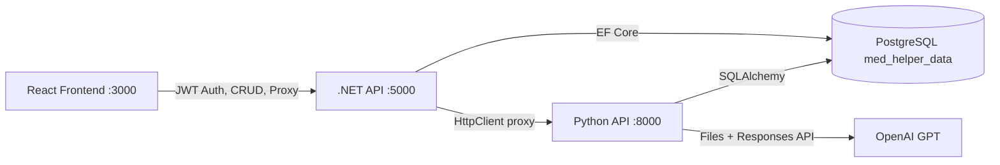

<!--
SYNC IMPACT REPORT
==================
Version change : 2.5.0 → 2.6.0 (MINOR)
Bump rationale : Section VII extended with "7.5 Hamshira (Nurse) Ko'rinishi" subsection.
                 Key distinction:
                 - Doctor (4): sees analyses assigned as treating physician (junction tables)
                 - Nurse (5): sees analyses they personally created (created_doctor_id filter)
                 - is_viewed / badge notification logic does NOT apply to Nurse role
                 Section 7.2 and 7.3 clarified — explicitly limited to Doctor (role 4).
                 Section 7.4 rules table updated with Nurse row.

Modified sections:
  • VII.1 — Ma'lumotlar Filtri: Nurse subsection added
  • VII.2 — is_viewed: explicitly scoped to Doctor (4) only
  • VII.3 — Menu Notification Badge: explicitly scoped to Doctor (4) only
  • VII.4 — Qoidalar Xulosasi: Nurse rows added

Added sections:
  • VII.5 — Hamshira Ko'rinishi (new subsection)

Removed sections  : none

Template alignment:
  ✅ .specify/templates/plan-template.md   — Constitution Check is generic.
  ✅ .specify/templates/spec-template.md   — No constitution references.
  ✅ .specify/templates/tasks-template.md  — No constitution references.

Still open:
  • C4-GAP-1: Patient.birthdate stored as DateOnly — NOT encrypted.
  • C4-GAP-2: analyse_file_link / generated_file_link — NOT encrypted.
-->

# NMED EKG Tahlili App — Constitution

## Project Overview

**NMED** — tibbiy tahlil platformasi (EKG, Laboratoriya, Holter, SMAD). Loyiha uch qatlamdan iborat:
- **Backend (.NET 8 / C#)** — CRUD, autentifikatsiya, avtorizatsiya, ma'lumotlar bazasi
- **Frontend (React 18)** — foydalanuvchi interfeysi, shifokor kabineti
- **AI/Scripting (Python FastAPI)** — EKG signal tahlili, AI diagnostika (OpenAI GPT)

---

## Core Principles

### I. Shared Database Architecture (MUHIM)
Backend (.NET) va Python (FastAPI) **bitta PostgreSQL bazaga** (`med_helper_data`) ulanadi.
- **Baza sxemasi** `.NET Entity Framework Migrations` tomonidan boshqariladi. Python tomoni `SQLAlchemy` orqali faqat yozish/o'qish qiladi.
- **Jadval nomlari** snake_case: `ecg_analyses`, `lab_analyses`, `holter_analyses`, `smad_analyses`, `medical_diagnoses`, `ecg_analyse_doctors`, `ecg_analyse_complaints` va h.k.
- **Yangi jadval qo'shish** faqat .NET Migrations orqali amalga oshiriladi. Python `models.py` faqat mavjud jadvallarni reflect qiladi.
- **Ustun nomlari** snake_case va ikkala tomonda identik bo'lishi shart: `patcient_id`, `created_doctor_id`, `clinic_id`, `status`, `ai_answer_data`, `analyse_file_link`, `generated_file_link`, va hokazo.

### II. Dual-Backend Architecture
Ikki alohida backend mavjud, har biri o'z vazifasini bajaradi:

| Qatlam | Texnologiya | Port | Vazifa |
|--------|-------------|------|--------|
| **.NET API** | ASP.NET Core 8 | `5000` (HTTP), `5001` (HTTPS) | CRUD, Auth (JWT), foydalanuvchi/klinika/shifokor/bemor boshqaruvi |
| **Python API** | FastAPI + Uvicorn | `8000` | EKG signal parsing, AI tahlil (OpenAI), Lab/Holter/SMAD tahlil |

- Frontend `.NET API` ga autentifikatsiya va CRUD so'rovlarini yuboradi.
- Frontend Python API ga **bevosita murojaat qilmaydi** — barcha tahlil so'rovlari `.NET API` orqali proxy qilinadi (C1 talabi).
- Ikkala backend bir-biri bilan bevosita so'zlashmaydi — faqat baza orqali. Python natijalarni bazaga yozadi, .NET ularni o'qib frontendga qaytaradi.

### III. Frontend Architecture
- **Framework**: React 18, Create React App (react-scripts)
- **State Management**: Zustand (yagona `Store.js`)
- **HTTP Client**: Axios — ikki alohida baseURL:
  - `.NET API` → `axiosInstance` interceptor bilan (JWT token boshqaruvi)
  - `Python API` → `.NET API` proxy orqali (bevosita murojaat taqiqlangan)
- **UI Library**: Ant Design (antd) v5
- **Routing**: react-router-dom v7
- **i18n**: react-i18next (uz, ru, en tillari)
- **Auth**: `js-cookie` orqali `NMED_token` saqlanadi
- **Sahifalar** (asosiy marshrутlar):
  - `/ecg-analyses` → `EcgAnalysesList` — klinikaga tegishli EKG tahlillari ro'yxati
    (pagination, bemor ismi/familiyasi/sharifi yoki passport seriyasi bo'yicha qidiruv,
    status filtri, sana oralig'i filtri — dan/gacha)
  - `/analyse-ecg` → `EcgAnalyzer` — yangi EKG qo'shish/tahlil qilish sahifasi
  - Non-admin foydalanuvchilar uchun default landing: `EcgAnalysesList`
  - Admin/SuperAdmin uchun default landing: `Doctors`
- **UI dizayn konventsiyalari**:
  - Input maydonlar: `className="login_input"` (Ant Design `Input`)
  - Tugmalar: `className="btn_form"`
  - Sana inputlar: `className="input_date"` (native `<input type="date">`) yoki `DatePicker.RangePicker`
  - Barcha ro'yxat sahifalarida filtr toolbar: `div.main_card_btn` ichida flex layout

### IV. API Contract Rules
Python endpointlari (faqat .NET proxy orqali chaqiriladi):
- `POST /api/analyze` — EKG fayl tahlili (XML/CSV/PNG → AI natija)
- `POST /api/analyze-save` — EKG faylni faqat saqlash (AI tahlilsiz)
- `POST /api/analyze-retry` — Mavjud tahlilni qayta yuborish
- `POST /api/med-diagnoses-save` — Tibbiy tashxis faylini saqlash
- `POST /lab/analyze` — Laboratoriya tahlili
- `POST /lab/analyze-save` — Lab faylini saqlash
- `POST /holter/analyze` — Holter tahlili
- `POST /smad/analyze` — SMAD tahlili

.NET endpointlari:
- `api/auth/*` — register, login, verify, change-password
- `GET api/ecg-analyses/get-by-clinic` — klinikaga tegishli ECG tahlillar ro'yxati
  (params: `page`, `pageSize`, `search` — bemor ismi/familiyasi/sharifi YOKI passport seriyasi,
  `status`, `dateFrom` — ISO sana, `dateTo` — ISO sana; ORDER BY id DESC)
  - Passport qidiruvi: agar `search` `[A-Za-z]{2}\d+` formatiga mos kelsa,
    klinika bemor passportlari in-memory AES deshifrlash orqali taqqoslanadi.
  Response DTO `PatcientForECG` maydoni: `id`, `birthDate`, `gender`,
  `firstName`, `lastName`, `sureName`, `passport` (deshifrlangan)
- `GET api/ecg-analyses/get-ecg-analyses-by-patcient-id` — bemorga tegishli ECG tahlillari
  (params: `id` — patient ID, `page`; pageSize = 5, ORDER BY createdAt DESC)
  Response DTO: `PagedResult<ECGAnalyseDTO>` (maydonlar: `id`, `status`, `analyseFileLink`,
  `generatedFileLink`, `generatedShortFileLink`, `aiAnswerData`, `patcient`, `createdDoctor`,
  `clinic`, `doctors`, `complaints`, `createdAt`, `updatedAt`)
- `api/ecg-analyses/*` — ECG CRUD + proxy (`/analyze`, `/analyze-save`, `/send-to-ai`)
- `api/lab-analyses/*` — Lab CRUD + proxy (`/analyze`)
- `api/holter-analyses/*`, `api/smad-analyses/*` — CRUD + proxy
- `api/doctors/*`, `api/patcients/*`, `api/clinics/*`, `api/regions/*`

### V. AI Integration Protocol
- **Provider**: OpenAI — model `gpt-4o` by default
  (`OPENAI_MODEL` environment variable orqali sozlanadi; `.env` da o'zgartirish mumkin)
- **Flow**: Frontend → .NET API (JWT) → Python API → OpenAI Files API → OpenAI Responses API → JSON javob → bazaga saqlash
- **Prompt tili**: O'zbek tilida professional kardiologiya terminlari
- **Javob formati**: Qat'iy JSON schema (`digital_measurements`, `automatic_analysis`, `automatic_analysis_bool`, `AI_recommendations`, `final_summary`)
- **API kalitlari** environment variable yoki konfiguratsiya fayllaridan o'qiladi (hardcoded taqiqlangan)

---

## Technology Stack Constraints

### Backend (.NET)
- **.NET 8**, EF Core 7 + Npgsql
- JWT autentifikatsiya (`Microsoft.AspNetCore.Authentication.JwtBearer`)
- BCrypt parol hashlash
- MailKit email jonatish
- iTextSharp PDF generatsiya
- Rate Limiting (1 daqiqada 5 marta — `strict` policy)
- CORS: `http://localhost:3000`, `https://nmed.uz`
- Swagger UI (faqat Development muhitda)

### Python
- FastAPI + Uvicorn
- SQLAlchemy + psycopg2 (PostgreSQL)
- NeuroKit2 — EKG signal processing
- NumPy, SciPy, Pandas — raqamli tahlil
- Matplotlib — EKG grafik rendering
- Pillow — rasm boshqaruvi
- OpenAI Python SDK
- fuzzywuzzy — lead nomi mos kelishi

### Frontend
- React 18, react-scripts (CRA)
- Zustand, Axios, Ant Design v5
- react-router-dom v7, react-i18next
- chart.js + react-chartjs-2
- js-cookie, react-input-mask, cleave.js
- dayjs (antd v5 peer dependency — DatePicker uchun)

---

## Development Workflow

### File Organization Rules
```
backend/EkgAnalyzerApi/
  ├── Controllers/     # API endpointlar (Controller per entity)
  ├── Services/        # Biznes logika
  ├── Models/          # EF Core entity modellari (snake_case table mapping)
  ├── DTOs/            # Request/Response DTO'lar
  ├── Data/            # DbContext (MedDataDB)
  ├── Migrations/      # EF Core migratsiyalar (baza sxemasi manba haqqoniyati)
  └── Program.cs       # DI, middleware, konfiguratsiya

python_back/
  ├── main.py          # Asosiy FastAPI app + EKG endpointlar
  ├── models.py        # SQLAlchemy modellari (bazadagi jadvallar reflect)
  ├── database.py      # DB connection
  ├── *_analyse.py     # CRUD helper'lar (create/update)
  ├── *_analyses_api.py # FastAPI Router submodulelar
  └── requirements.txt # Python dependencies

frontend/src/
  ├── host/            # API konfiguratsiya (Host.js, Api.js, *Service.js)
  ├── host/requests/   # Entity-based API request funksiyalari
  ├── store/           # Zustand global store
  ├── pages/           # Sahifalar (auth/, cabinet/)
  ├── components/      # Qayta ishlatiladigan komponentlar
  ├── locale/          # i18n tarjimalar
  └── App.js           # Root komponent
```

### Code Conventions
1. **Naming**:
   - C#: PascalCase (class, method), camelCase (local vars)
   - Python: snake_case (func, var), PascalCase (class)
   - React: PascalCase (components), camelCase (functions, state vars)
   - DB columns: snake_case
2. **Error Handling**:
   - .NET: try-catch + `BadRequest`/`Unauthorized` response. Catch blok **hech qachon bo'sh bo'lmasligi SHART** — kamida `ILogger` orqali log qilinsin.
   - Python: try-except + `HTTPException` yoki `JSONResponse(content={error})`
   - Frontend: try-catch + `handleApiError(error)` — Ant Design `message` API orqali foydalanuvchiga ko'rsatiladi (`frontend/src/tools/notify.js`)
3. **Status Codes** (ECG/Lab/Holter/SMAD tahlillari):
   - `0` — yaratildi (kutmoqda)
   - `1` — fayl qayta ishlandi (AI kutmoqda)
   - `2` — AI natija tayyor
   - `-1` — AI xatolik
4. **Logging (Python)**:
   - `print()` chaqiruvlari production kodida **taqiqlangan**. Buning o'rniga `import logging` va `logger = logging.getLogger(__name__)` ishlatilishi SHART.
   - Sezgir ma'lumotlar (patient ID, passport, file paths) log satrlarda ochiq ko'rinmasligi SHART.
5. **Startup validation**:
   - Har qanday majburiy konfiguratsiya (`JWT_SECRET`, `OPENAI_API_KEY`, `AES_KEY` va h.k.) ilova ishga tushayotganda tekshirilishi SHART.
   - Qiymat topilmasa — `RuntimeError` yoki `InvalidOperationException` chiqarib, ilova to'xtatilishi SHART. Silent fallback (masalan, anonymous user qaytarish) taqiqlangan.

---

## Security Requirements

> ✅ **BAJARILGAN** (2026-04-05):
> - API kalitlari `.env` / `appsettings.Development.json` ga ko'chirildi
> - Python API JWT autentifikatsiya qo'shildi (`verify_token`)
> - CORS cheklandi (aniq domenlar)
> - reCAPTCHA secret key config dan o'qiladi
> - Database credentials `.env` dan o'qiladi
> - `PasswordPlain` koddan olib tashlandi

> ✅ **BAJARILGAN** — Kiber xavfsizlik sertifikatsiyasi talablari (C1–C4):
> 1. **C1 — Proxy arxitektura**: `PythonApiProxyService.cs` + barcha Controller'lar (ECG, Lab, Holter, SMAD, MedDiagnose) `.NET API` orqali Python API ga proxy qiladi. Frontend to'g'ridan-to'g'ri Python API ga murojaat qilmaydi.
> 2. **C2 — Audit log**: `AuditMiddleware.cs` (avtomatik POST/PUT/PATCH/DELETE loglash) + `AuditLog.cs` model + `AuditLogService.cs` + `AuditLogController.cs` (Admin/SuperAdmin uchun). Filtrlar: action, userId, entityType, date range.
> 3. **C3 — Rate limiting**: `Program.cs` da uch pog'onali: `strict` (5/daqiqa — login/register), `ai-analysis` (10/daqiqa — AI tahlil), `general` (100/daqiqa — umumiy). 429 status kod qaytariladi.
> 4. **C4 — AES-256 shifrlash**: `EncryptionService.cs` (AES-256-CBC, tasodifiy IV, PKCS7). Bemor `passport` maydoni shifrlangan saqlanadi ✅. `birthdate` va fayl yo'llari hali shifrlanmagan ⚠️ — qarang: C4-GAP-1, C4-GAP-2.

> ✅ **TUZATILGAN** (2026-04-06):
> - **C5**: `config.py` — `JWT_SECRET` yo'q bo'lsa `RuntimeError` chiqaradi; `auth_middleware.py` anonymous bypass o'rniga HTTP 500 qaytaradi.
> - **C6**: `Program.cs` — `RequireHttpsMetadata = !IsDevelopment()`. Production da HTTPS majburiy.
> - **T5**: `main.py` — barcha 15 ta debug `print()` o'chirildi.
> - **T6**: `Program.cs` — migration catch bloki `ILogger<Program>` orqali loglaydi.

---

## Cybersecurity Certification Requirements (O'z DSt 2814:2014 3-daraja)

### C1. Proxy Arxitektura (POST endpointlar)
Frontend **hech qachon** to'g'ridan-to'g'ri Python API ga murojaat qilmasligi SHART. Barcha so'rovlar `.NET API` orqali proxy qilinadi:
```
Frontend → .NET API (JWT tekshiruv) → Python API (tahlil) → bazaga yozish
```
Kerakli endpointlar:
- `POST api/ecg-analyses/analyze` → proxy → Python `/api/analyze`
- `POST api/ecg-analyses/analyze-save` → proxy → Python `/api/analyze-save`
- `POST api/ecg-analyses/send-to-ai` → proxy → Python `/api/analyze-retry`
- `POST api/lab-analyses/analyze` → proxy → Python `/lab/analyze`
- `POST api/holter-analyses/analyze` → proxy → Python `/holter/analyze`
- `POST api/smad-analyses/analyze` → proxy → Python `/smad/analyze`
- `POST api/med-diagnose/save` → proxy → Python `/api/med-diagnoses-save`

### C2. Audit Log (TT 4.1.6)
Barcha foydalanuvchi amallari o'zgartirib bo'lmaydigan logga yozilishi SHART:
- `audit_logs` jadvali: `user_id`, `action`, `entity_type`, `entity_id`, `old_values`, `new_values`, `ip_address`, `timestamp`
- Middleware darajasida avtomatik loglash
- Admin uchun loglarni ko'rish interfeysi

### C3. Rate Limiting (TT 4.1.6.3)
IP asosida differensiallashtirilgan cheklovlar:
| Endpoint turi | Limit |
|---------------|-------|
| Login/Register | 5 / daqiqa |
| API umumiy | 100 / daqiqa |
| AI tahlil | 10 / daqiqa |

### C4. AES-256 Shifrlash (TT 4.4.2)
Quyidagi ma'lumotlar bazada **shifrlangan** saqlanishi SHART:
- Bemor `passport` raqami
- Bemor `birthdate` (tug'ilgan sana)
- Tibbiy tashxis fayllarining yo'li
- Shifrlash kaliti environment variable'da saqlanadi

**Muhim**: AES-256-CBC tasodifiy IV ishlatadi — bir xil matnni ikki marta shifrlash har xil natija beradi.
Shuning uchun passport bo'yicha DB darajasida qidiruv **mumkin emas**. Passport qidiruvi
in-memory amalga oshirilishi SHART: bemor passportlari `EncryptionService.Decrypt()` orqali
deshifrlangach, qiymat taqqoslanadi.

### C5. JWT va API Kalitlari Konfiguratsiya Xavfsizligi
- `JWT_SECRET` (Python) va `Jwt:Key` (.NET) environment variable'lardan o'qilishi SHART.
- `OPENAI_API_KEY` (Python) environment variable'dan o'qilishi SHART.
- `JWT_SECRET` **yo'q** yoki bo'sh holatda Python API `RuntimeError` chiqarib ishga tushmasligi SHART.
- `OPENAI_API_KEY` **yo'q** yoki bo'sh holatda Python API `RuntimeError` chiqarib ishga tushmasligi SHART.
  - Sabab: kalitlar bo'lmasa servis ishlamaydi — erta to'xtatish xafsizroq.
- Silent fallback (`return {"user_id": None, "role": "anonymous"}`) **taqiqlangan**.

### C6. HTTPS Majburlash
- `.NET API` da `RequireHttpsMetadata` faqat `Development` muhitida `false` bo'lishi mumkin.
- `Production` va `Staging` muhitlarida `RequireHttpsMetadata = true` bo'lishi SHART.
  - Sabab: `false` holatda JWT Bearer tokenlar HTTP orqali ham qabul qilinadi — MITM hujumida token o'g'irlanishi mumkin.
- Sozlama `IHostEnvironment.IsDevelopment()` shartiga bog'langan bo'lishi SHART.

---

## Integration Points (Aloqa Nuqtalari)



### Critical Sync Points
1. **`ecg_analyses` jadvali** — Python yozadi (status, ai_answer_data, file_links), .NET o'qiydi (paginatsiya, DTO mapping)
2. **`lab_analyses` jadvali** — Python yozadi (lab qiymatlari + AI natija), .NET o'qiydi
3. **Shared entitiy IDs** — `patcient_id`, `doctor_id`, `clinic_id` bir xil FK schema
4. **File paths** — Python `uploads/` papkasiga yozadi (`/uploads/ecg_analyse_files/`, `/uploads/ecg_generated_files/`), .NET `StaticFiles` orqali serve qilishi kerak
5. **Audit logs** — faqat .NET API tomonidan yoziladi (Python API o'z loglarini `logging` moduli orqali chiqaradi)

---

## VI. User Roles & Access Control

### Tizim Rollari (Role Table)

| ID | Konstanta | Nomi (uz) | Tavsif |
|----|-----------|-----------|--------|
| 1 | `SuperAdmin` | SuperAdmin | Tizim darajasidagi administrator. Barcha klinikalar va loglarni ko'ra oladi. |
| 2 | `Admin` | Admin | Shifoxona admini. Faqat o'z klinikasi xodimlarini boshqaradi. |
| 3 | `Director` | Bosh shifokor | Shifoxona direktori. Admin bilan bir xil kabinet vakolatlariga ega. |
| 4 | `Doctor` | Shifokor | Klinika shifokori. Tahlillar olib boradi. |
| 5 | `Nurse` | Hamshira | Hamshira. Tahlillar olib boradi. |

### Kabinet Kirish Qoidalari

1. **Admin (2) va Direktor (3) kabinetlari bir xil**: Ikkala rol ham `/doctor`
   (xodimlar), `/doctor/create`, `/doctor/create/:id` va `/settings` sahifalariga
   kirish huquqiga ega. Default landing — `Doctors` sahifasi.

2. **Shifokor (4) va Hamshira (5)**: `/ecg-analyses` — default landing.
   - Barcha tahlil sahifalariga (`/ecg-analyses`, `/holter-analyses`, `/smad-analyses`,
     `/lab-analyses`, `/patient-diagnoses`) ruxsat bor.
   - `/doctor` (xodimlar) va `/settings` (tashkilot haqida) — TAQIQLANGAN.
     Sidebar menusida ham ko'rinmasligi SHART.
   - Tahlil ro'yxati sahifalarida **faqat shu shifokor davolovchi sifatida belgilangan**
     (junction table orqali assigned) ma'lumotlar ko'rinishi SHART.
     Butun klinika ma'lumotlari emas — qarang: VII bob.

3. **SuperAdmin (1)**: Tizim darajasi. Klinika kabineti oqimiga kirmaydi — alohida
   boshqaruv interfeysi orqali ishlaydi.

### Xodimlar Sahifasi (Doctors) — O'z-o'zini ko'rsatmaslik Qoidasi

- `/doctor` sahifasi `GET api/doctor/get-doctors-of-clinic` endpointidan ma'lumot oladi.
- Backend (`DoctorService.GetDoctorsAsync`) **joriy foydalanuvchini** (`u.Id != user_id`)
  so'rov natijasidan **chiqarib tashlashi SHART**.
- Sabab: Admin yoki Direktor o'z profilini "xodim" sifatida ko'rishi va tahrirlashi
  chalkashlik tug'diradi.
- Bundan tashqari, Admin roli (`RoleId == 2`) va SuperAdmin roli (`RoleId == 1`) ham
  ro'yxatdan chiqarib tashlanadi (mavjud filtr).

### Rol-marshrut Matritsa (Frontend)

| Marshrut | Admin (2) | Direktor (3) | Shifokor (4) | Hamshira (5) |
|----------|-----------|--------------|--------------|--------------|
| `/` (default) | Doctors | Doctors | EcgAnalysesList | EcgAnalysesList |
| `/doctor` | ✅ | ✅ | ❌ | ❌ |
| `/settings` | ✅ | ✅ | ❌ | ❌ |
| `/ecg-analyses` | ✅ | ✅ | ✅ | ✅ |
| `/holter-analyses` | ✅ | ✅ | ✅ | ✅ |
| `/smad-analyses` | ✅ | ✅ | ✅ | ✅ |
| `/lab-analyses` | ✅ | ✅ | ✅ | ✅ |
| `/patient-diagnoses` | ✅ | ✅ | ✅ | ✅ |

---

## VII. Doctor View & Notification System

### 7.1 Shifokor Ko'rinishi — Ma'lumotlar Filtri

Shifokor (4) tizimga kirganda tahlil sahifalari butun klinika ma'lumotlarini emas,
**faqat o'sha shifokor davolovchi (treating physician) sifatida belgilangan** tahlillarni
ko'rsatishi SHART.

Davolovchi sifatida belgilanish junction tablalari orqali aniqlanadi:

| Tahlil turi | Junction jadval | Doctor FK ustuni |
|-------------|-----------------|------------------|
| ECG | `ecg_analyse_doctors` | `doctor_id` |
| Holter | `holter_analyse_doctors` | `doctor_id` |
| SMAD | `smad_analyse_doctors` | `doctor_id` |
| Laboratoriya | `lab_analyse_doctors` | `doctor_id` |
| Shifokor xulosasi | `medical_diagnoses.main_doctor_id` (to'g'ridan-to'g'ri) | `doctor_id` |

Backend har bir tahlil turi uchun alohida endpoint SHART:
```
GET api/ecg-analyses/get-by-doctor       (query: page, pageSize, search, status, dateFrom, dateTo)
GET api/holter-analyses/get-by-doctor    (query: page, pageSize, search, status, dateFrom, dateTo)
GET api/smad-analyses/get-by-doctor      (query: page, pageSize, search, status, dateFrom, dateTo)
GET api/lab-analyses/get-by-doctor       (query: page, pageSize, search, status, dateFrom, dateTo)
GET api/med-diagnose/get-by-doctor       (query: page, pageSize, search, dateFrom, dateTo)
```

Frontend sahifalar `user.roleId === 4` shartiga qarab `get-by-doctor` endpointini
chaqiradi. Hamshira (5) uchun alohida endpoint ishlatiladi — qarang: 7.5.

### 7.2 Ko'rilgan/Ko'rilmagan Status (`is_viewed`) — faqat Shifokor (4)

Bu mexanizm **faqat Shifokor (rol 4) uchun** amal qiladi. Hamshira (5) uchun `is_viewed`
talab qilinmaydi — chunki hamshira faqat o'zi qo'shgan tahlillarni ko'radi (7.5-bo'lim).

Har bir junction table qatorida **`is_viewed`** (boolean, default `false`) ustuni bo'lishi
SHART. Bu ustun shifokor o'sha tahlilni birinchi marta ochganda `true` ga o'tkaziladi.

**DB migratsiya (EF Core):**
- `ecg_analyse_doctors.is_viewed` — bool, default `false`
- `holter_analyse_doctors.is_viewed` — bool, default `false`
- `smad_analyse_doctors.is_viewed` — bool, default `false`
- `lab_analyse_doctors.is_viewed` — bool, default `false`

Shifokor xulosasi (`medical_diagnoses`) uchun alohida junction yo'q — shu jadvalda
`is_viewed` maydonini to'g'ridan-to'g'ri qo'shish SHART.

**Modellarni yangilash:**
- `ECGAnalyseDoctors.cs` — `IsViewed` property (Column: `is_viewed`)
- `HolterAnalyseDoctors.cs` — `IsViewed` property
- `SmadAnalyseDoctors.cs` — `IsViewed` property
- `LabAnalyseDoctors.cs` — `IsViewed` property
- `MedicalDiagnoses.cs` — `IsViewed` property

**Mark-as-viewed endpointlari (batch — sahifaga kirish bilan):**
```
PUT api/ecg-analyses/mark-viewed-by-doctor     (body: { doctor_id })
PUT api/holter-analyses/mark-viewed-by-doctor  (body: { doctor_id })
PUT api/smad-analyses/mark-viewed-by-doctor    (body: { doctor_id })
PUT api/lab-analyses/mark-viewed-by-doctor     (body: { doctor_id })
PUT api/med-diagnose/mark-viewed-by-doctor     (body: { doctor_id })
```

Yoki alternativ: `put-by-id` — faqat bitta tahlil ochilganda belgilash.
Har ikkala usul ham response ichida yangi `unviewed_count` qaytarishi SHART.

**Frontend — ko'rilgan status ko'rsatish:**
Tahlil ro'yxati jadvalida har bir qatorda `is_viewed` ga qarab vizual indikator:
- Ko'rilmagan: `Badge` (rang: sariq yoki ko'k) — ustun: "Ko'rildi" → Yo'q
- Ko'rilgan: yashil belgisi yoki "Ko'rildi" matni

### 7.3 Menu Notification Badge (Ko'rilmagan Tahlillar Soni) — faqat Shifokor (4)

Bu mexanizm **faqat Shifokor (rol 4) uchun** amal qiladi. Hamshira (5) uchun
unviewed badge ko'rsatilmaydi.

Sidebar menudagi har bir tahlil tipiga tegishli itemda shifokor hali ko'rmagan
tahlillar soni **badge (notification count)** sifatida ko'rinishi SHART.

**Backend — unviewed count endpointlari:**
```
GET api/ecg-analyses/unviewed-count      → { count: N }
GET api/holter-analyses/unviewed-count   → { count: N }
GET api/smad-analyses/unviewed-count     → { count: N }
GET api/lab-analyses/unviewed-count      → { count: N }
GET api/med-diagnose/unviewed-count      → { count: N }
```

Har bir endpoint JWT token ichidagi `doctor_id` ni olib, o'sha doktor uchun
`is_viewed = false` qatorlar sonini qaytaradi. Rol 4/5 bo'lmagan foydalanuvchilar
uchun `0` qaytariladi (yoki 403).

**Frontend — Zustand Store:**
```js
ecg_unread: 0,       setecg_unread: (n) => set({ ecg_unread: n }),
holter_unread: 0,    setholter_unread: (n) => set({ holter_unread: n }),
smad_unread: 0,      setsmad_unread: (n) => set({ smad_unread: n }),
lab_unread: 0,       setlab_unread: (n) => set({ lab_unread: n }),
diagnoses_unread: 0, setdiagnoses_unread: (n) => set({ diagnoses_unread: n }),
```

Ilovaga kirish vaqtida (App.js — user ma'lumotlari yuklangandan so'ng) va har
mark-viewed operatsiyasidan so'ng bu qiymatlar yangilanadi.

**Frontend — SideBar badge render qoidasi:**
- `count > 0` → `<Badge count={count}>` — `antd` `Badge` komponenti ishlatiladi
- `count === 0` → badge **UMUMAN ko'rinmasligi SHART** (`showZero={false}` yoki
  shartli render). 0 raqami hech qachon menuda ko'rsatilmasligi shart.

**Frontend — Sahifaga kirish (`useEffect` on mount):**
Shifokor (rol 4/5) tegishli sahifaga kirganda darhol `mark-viewed-by-doctor` API
chaqiriladi va tegishli Zustand unread count nolga tushiriladi:
```js
useEffect(() => {
  if (user.roleId === 4 || user.roleId === 5) {
    markViewedByDoctor()          // API call
    setecg_unread(0)              // clear badge immediately (optimistic)
  }
}, [])
```

### 7.4 Qoidalar Xulosasi

| Qoida | Shart darajasi |
|-------|---------------|
| Shifokor tahlil sahifalarida faqat o'ziga assigned tahlillarni ko'radi | SHART |
| `is_viewed` ustuni barcha junction tablalarda mavjud bo'lishi | SHART |
| Ko'rilmagan tahlillar menuda badge sifatida ko'rinishi | SHART |
| Badge count 0 bo'lsa ko'rinmasligi | SHART |
| Shifokor sahifaga kirishi bilan badge 0 ga tushishi | SHART |
| Admin/Direktor uchun bu mantiq ishlamasligi (klinika ko'rinishi qolishi) | SHART |

---

## Governance

- Ushbu konstitutisya loyihaning barcha qismlariga tegishli va barcha o'zgarishlardan oldin tekshirilishi SHART.
- Baza sxemasiga o'zgarish kiritish faqat .NET Migrations orqali amalga oshirilishi SHART.
- Yangi endpoint qo'shishda ikkala backend va frontendni sinxronlashtirish SHART.
- **Kiber xavfsizlik sertifikatsiyasi** talablari (C1–C6) birinchi ustuvor vazifa.
- Frontend → Python API bevosita aloqasi qat'iyan taqiqlangan (proxy orqali SHART).
- Shaxsiy ma'lumotlar faqat shifrlangan ko'rinishda saqlanishi SHART.
- **Versioning**: MAJOR — printsiplarni olib tashlash/qayta aniqlash; MINOR — yangi bo'lim/printsip qo'shish; PATCH — aniqlashtirish, imlo.
- **Amend procedure**: Konstitutisya faqat komanda yig'ilishida muhokama qilingandan so'ng o'zgartirilishi mumkin. Har qanday o'zgartirish `Last Amended` sanasini yangilaydi.

**Version**: 2.5.0 | **Ratified**: 2026-04-03 | **Last Amended**: 2026-04-06
