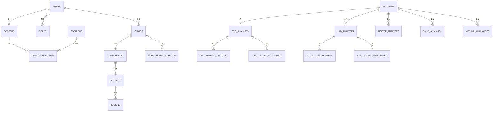

# Feature Specification: NMED AI Tibbiy Tahlil Platformasi

**Feature Branch**: `main`
**Created**: 2026-04-03
**Status**: Existing System — Reverse-Engineered Spec
**Services**: `api.nmed.uz` (.NET API), `analyse.nmed.uz` (Python AI API), `nmed.uz` (React Frontend)

---

## Tizim Haqida Umumiy Ma'lumot

NMED — tibbiy muassasalar uchun AI yordamida EKG, Laboratoriya, Holter va SMAD tahlillarini avtomatlashtiruvchi ko'p qatlamli platforma.

**Asosiy foydalanuvchilar**: Tibbiy klinikalar, kardiologlar va shifokorlar.

**Tillar**: O'zbek (`uz`), Rus (`ru`), Ingliz (`en`)

---

## User Scenarios & Testing

### User Story 1 — Shifokor ro'yxatdan o'tishi va kirishi (Priority: P1)

Yangi shifokor `nmed.uz` da ro'yxatdan o'tadi: username, email, parol kiritadi, reCAPTCHA tasdiqlaydi, emailga 4 xonali tasdiqlash kodi keladi, kodni kiritib akkauntini faollashtiradi. Shundan keyin login paytida JWT token oladi va kabinetga kiradi.

**Why this priority**: Tizimga kirish imkonisiz boshqa hech narsa ishlamaydi. Bu eng asosiy funksiyallik.

**Independent Test**: `POST /api/auth/register` → email kelishi → `POST /api/auth/verify` → `POST /api/auth/login` → JWT token, `NMED_token` cookie da saqlash.

**Acceptance Scenarios**:

1. **Given** foydalanuvchi `nmed.uz` ga kiradi, **When** username/email/parol kiritib register qiladi, **Then** emailga 4 xonali kod keladi (`status=false`)
2. **Given** kod emailda bor, **When** kodni 10 daqiqa ichida kiritadi, **Then** `status=true`, JWT token qaytariladi
3. **Given** noto'g'ri username, **When** login qilmoqchi bo'ladi, **Then** `user_not_found` xatoligi
4. **Given** aktiv bo'lmagan akkaunt, **When** login qilmoqchi, **Then** `email_not_verified` xatoligi
5. **Given** reCAPTCHA ball < 0.5, **When** register/login, **Then** `400 Bad Request`

---

### User Story 2 — Bemor ma'lumotlarini kiritish (Priority: P1)

Shifokor bemorni pasport seriyasi + tug'ilgan sana orqali qidiradi. Agar bemor baza da mavjud bo'lsa — ma'lumotlar yuklanadi va yangilanadi. Agar yo'q bo'lsa — yangi bemor yaratimladi.

**Why this priority**: Barcha tahlillar bemor ID siga bog'liq. Patient yaratilmasdan tahlil boshlanmaydi.

**Independent Test**: `GET /api/patcient/get-patient-by-passport?passport=XX&birthdate=YYYY-MM-DD`

**Acceptance Scenarios**:

1. **Given** pasport seriyasi va tug'ilgan sana, **When** qidiruv so'rovi, **Then** mavjud bemor ma'lumotlari qaytariladi
2. **Given** mavjud bo'lmagan pasport, **When** `404`, **Then** yangi bemor yaratish formi ochiladi
3. **Given** `POST /api/patcient/save-patient-data`, **When** mavjud bemor yangilansa, **Then** ma'lumotlar update bo'ladi (upsert)
4. **Given** noto'g'ri tug'ilgan sana formati, **When** saqlansa, **Then** `400 Invalid birthdate format`

---

### User Story 3 — EKG faylini AI orqali tahlil qilish (Priority: P1)

Shifokor bemorning EKG faylini (XML, CSV, PNG, JPG, PDF) Python API ga yuboradi. Tizim:
1. Faylni saqlaydi
2. EKG signal qiymatlarini raqamli hisoblaydi (XML/CSV uchun)
3. EKG grafigini PNG ga render qiladi
4. OpenAI GPT ga yuboradi
5. AI natijasini JSON formatda qaytaradi va bazaga saqlaydi

**Why this priority**: Platformaning asosiy biznes qiymati — AI tahlil.

**Independent Test**: `POST http://analyse.nmed.uz/api/analyze` — XML fayl + bemor parametrlari → JSON natija

**Acceptance Scenarios**:

1. **Given** to'g'ri XML fayl + majburiy maydonlar, **When** `/api/analyze`, **Then** `ecg_id`, `ai_response` JSON, `ecg_png_base64` link qaytariladi
2. **Given** PNG rasm fayli, **When** `/api/analyze`, **Then** rasm digitalizatsiyasiz to'g'ridan-to'g'ri GPT ga yuboriladi
3. **Given** OpenAI xatoligi, **When** tahlil, **Then** `status=-1`, `ai_error=true`, natija baribir saqlanadi
4. **Given** `/api/analyze-save`, **When** AI tahlilsiz saqlash, **Then** faqat fayl saqlanadi, `status=1`
5. **Given** `/api/analyze-retry?id=X`, **When** muvaffaqiyatsiz tahlil qayta yuborilsa, **Then** avvalgi fayl ishlatiladi

---

### User Story 4 — Laboratoriya natijasini AI orqali tahlil qilish (Priority: P2)

Shifokor lab natijasi rasmini yoki faylini yuboradi. GPT faylon tahlil qilib qon va peshob ko'rsatkichlarini aniqlaydi, raqamli qiymatlarni bazaga yozadi.

**Why this priority**: EKG dan keyin eng ko'p ishlatiladigan modul.

**Independent Test**: `POST http://analyse.nmed.uz/lab/analyze` — rasm/fayl + parametrlar

**Acceptance Scenarios**:

1. **Given** lab natija rasmi, **When** `/lab/analyze`, **Then** `digital_measurements` (hb, rbc, wbc va h.k.) ni aniqlaydi va bazaga yozadi
2. **Given** aniqlab bo'lmaydigan parametrlar, **Then** ular `null` qiymat oladi
3. **Given** `/lab/analyze-save`, **Then** faqat fayl saqlanadi, AI tahlilsiz
4. **Given** noto'g'ri format, **Then** xatolik JSON qaytariladi

---

### User Story 5 — Holter va SMAD tahlili (Priority: P2)

Holter (24 soatlik EKG monitoring) va SMAD (qon bosimi monitoring) natijalari GPT orqali tahlil qilinadi.

**Independent Test**: `POST /holter/analyze`, `POST /smad/analyze`

**Acceptance Scenarios**:

1. **Given** Holter natija fayli, **When** tahlil, **Then** `automatic_analysis`, `automatic_analysis_bool`, `final_summary` JSON qaytadi
2. **Given** SMAD natija, **When** tahlil, **Then** bir xil JSON format
3. **Given** `main_doctor_id` kiritilmasa, **Then** `422 Unprocessable Entity`

---

### User Story 6 — Tibbiy tashxis faylini saqlash (Priority: P3)

Shifokor bemor uchun tibbiy tashxis hujjatini tizimga yuklaydi (AI tahlilsiz, faqat arxivlash).

**Independent Test**: `POST /api/med-diagnoses-save`

**Acceptance Scenarios**:

1. **Given** fayl + majburiy maydonlar, **When** yuklash, **Then** `{status: true}` qaytadi
2. **Given** `main_doctor_id` va `created_doctor_id` turli shifokorlar bo'lsa, **Then** ikkalasi ham yoziladi

---

### User Story 7 — Klinika va xodimlarni boshqarish (Priority: P2)

Klinika admini xodimlar (`Doctor`) qo'shadi, ularning lavozimlarini belgilaydi, klinika ma'lumotlarini yangilaydi (nomi, logo, bank rekvizitlari).

**Acceptance Scenarios**:

1. **Given** `POST /api/doctor/save-doctor-data`, **When** yangi xodim, **Then** User + Doctor + DoctorPosition yaratiladi
2. **Given** mavjud `doctor_id`, **When** yangilash, **Then** update bo'ladi
3. **Given** `GET /api/doctor/get-doctors-of-clinic`, **When** so'rov, **Then** o'sha klinikaning xodimlari paginatsiya bilan qaytadi
4. **Given** `POST /api/clinic/update-clinic-data` + logo rasmi, **When** saqlash, **Then** klinika nomi va logo yangilanadi

---

### Edge Cases

- **Fayl nomi bo'sh space bilan**: `get_unique_filename()` `_` ga almashtiradi
- **Bir xil nomdagi fayl mavjud**: `filename_1.xml`, `filename_2.xml` kabi unik nom yaratiladi
- **OpenAI upload muvaffaqiyatsiz**: `ai_error=true` qaytariladi, baza yozuvi `status=-1`
- **GPT JSON emas matn qaytarsa**: `{"raw": "..."}` sifatida saqlanadi
- **XML faylda lead nomlari noto'g'ri yozilgan**: `fuzzywuzzy` orqali ~75% mos kelsa qabul qilinadi
- **JWT muddati o'tsa (24 soat)**: Frontend `NMED_token` o'chirib `/` ga yo'naltiradi
- **Klinikaga bog'liq bo'lmagan shifokor so'rovi**: Shifokor faqat o'z klinikasining ma'lumotlarini ko'radi (baza shu klinika ID si bilan filtrlanadi)
- **Pasport katta-kichik harf**: Saqlashda har doim `passport.ToUpper()` qilinadi

---

## Requirements

### Functional Requirements

**Autentifikatsiya:**
- **FR-001**: Tizim foydalanuvchi ro'yxatdan o'tishi paytida email orqali tasdiqlash kodi yuborishi SHART (10 daqiqa muddatli, 4 xonali)
- **FR-002**: Tizim login/register paytida Google reCAPTCHA v3 ni tekshirishi SHART (ball ≥ 0.5)
- **FR-003**: Tizim JWT token (24 soat muddatli, HMAC-SHA256) berishI va tekshirishi SHART
- **FR-004**: Parol BCrypt bilan hashlanishi SHART; oddiy matn ham `password_plain` da saqlanadi ⚠️

**Bemor boshqaruvi:**
- **FR-005**: Bemor `passport + birthdate` kombinatsiyasi yagona identifikator bo'lishi SHART (upsert)
- **FR-006**: Bemor o'chirish funksiyasi YO'Q (faqat create/update)
- **FR-007**: Bemor ma'lumotlari: `passport (UPPER)`, `firstname`, `lastname`, `surename`, `birthdate`, `gender (bool)`, `phone`, `address`, `district_id`

**EKG Tahlili:**
- **FR-008**: Python API quyidagi fayl formatlarini qabul qilishi SHART: `.xml` (HL7 standart), `.csv`, `.txt`, `.tsv`, `.png`, `.jpg`, `.jpeg`, `.pdf`
- **FR-009**: XML HL7 formatida `sampleRate`, lead nomi va `digits` qiymatlari to'g'ri parse qilinishi SHART
- **FR-010**: EKG signal tozalanib 12-lead PNG grafigi render qilinishi SHART (DPI=650, matplotlib)
- **FR-011**: Raqamli hisob-kitoblar amalga oshirilishi SHART: `HR`, `PR interval`, `QRS duration`, `QT interval`, `QTc Bazett`, `QRS axis`, `ST segment`, `P wave`, `T wave`, `Sokolow-Lyon index`
- **FR-012**: AI javob qat'iy JSON formatida bo'lishi SHART (shablon: `digital_measurements`, `automatic_analysis`, `automatic_analysis_bool`, `AI_recommendations`, `final_summary`)
- **FR-013**: AI javob bazada `ai_answer_data (TEXT)` ustunida to'liq JSON matn sifatida saqlanishi SHART

**Laboratoriya:**
- **FR-014**: Lab natija parametrlari (hb, rbc, wbc, plt, hct, mcv, mch, mchc, esr, glucose, cholesterol, alt, ast, bilirubin_total, bilirubin_direct, creatinine, urea, total_protein, albumin, calcium, sodium, potassium, iron, tsh, free_t4, insulin; peshob: urine_volume, urine_density, urine_ph, urine_protein, urine_glucose, urine_ketones, urine_bilirubin, urobilinogen, urine_rbc, urine_wbc; kunlik: daily_protein, daily_creatinine, daily_calcium, daily_sodium) alohida ustunlarda saqlanishi SHART

**Xodimlar:**
- **FR-015**: Har bir `Doctor` foydalanuvchisi `User` (1:1), `Clinic` va kamida bir `DoctorPosition` (lavozim) bilan bog'liq bo'lishi SHART
- **FR-016**: Yangi ro'yxatdan o'tgan foydalanuvchi uchun bo'sh `Clinic` va `Doctor` avtomatik yaratilishi SHART
- **FR-017**: Default position `id=77` yangi registratsiyada qo'shilishi SHART

**Klinika:**
- **FR-018**: Klinika ma'lumotlari: `clinic_name`, `clinic_logo`, `bank_accaunt`, `mfo`, `bank_name`, `inn`, `license`, `address`, `district_id`, telefon raqamlari

**Umumiy:**
- **FR-019**: Barcha analiz so'rovlarida `clinic_id`, `patcient_id`, `created_doctor_id`, `lang`, `age`, `gender` majburiy bo'lishi SHART
- **FR-020**: Rate Limiting: `.NET API` da 1 minutda 5 ta so'rov (`strict` policy)
- **FR-021**: Barcha analiz holatlari: `0` (kutmoqda), `1` (fayl saqlandi), `2` (AI tayyor), `-1` (xatolik)

### Key Entities

**User** (`users` jadvali)
- `id`, `email` (unique), `username` (unique), `password_hash`, `password_plain` ⚠️
- `role_id → roles`, `clinic_id → clinics`
- `status: bool` (email tasdiqlangan = `true`)

**Doctor** (`doctors` jadvali)
- `id`, `user_id → users` (1:1 munosabat)
- `firstname`, `lastname`, `surename`, `gender`, `phone`
- `DoctorPositions` → `positions` (ko'p-ko'p)

**Role** (`roles` jadvali)
- `id`, `name_uz`, `name_ru`, `name_en`
- Default: `role_id=2` (shifokor)

**Clinic** (`clinics` jadvali)
- `id`, `clinic_name`, `clinic_logo` (fayl yo'li)
- 1:1 → `ClinicDetail`, 1:N → `Users`, `ClinicPhoneNumbers`

**ClinicDetail** (`clinic_details` jadvali)
- `clinic_id`, `bank_accaunt`, `mfo`, `bank_name`, `inn`, `license`, `address`, `district_id`

**Patcient** (`patcients` jadvali) — [Yozuv xatosi: "Patcient" = "Patient"]
- `id`, `passport` (UPPER), `birthdate`, `firstname`, `lastname`, `surename`, `gender`, `phone`, `address`, `district_id`
- 1:N → `ECGAnalyses`, `LabAnalyses`, `MedicalDiagnoses`

**ECGAnalyses** (`ecg_analyses` jadvali)
- `id`, `patcient_id`, `created_doctor_id`, `clinic_id`
- `status: int` (0/1/2/-1)
- `analyse_file_link` (asl fayl), `generated_file_link` (to'liq PNG), `generated_short_file_link` (minified PNG)
- `ai_answer_data: TEXT` (to'liq JSON)
- N:M → `ecg_analyse_doctors`, `ecg_analyse_complaints`

**LabAnalyses** (`lab_analyses` jadvali)
- `id`, `patcient_id`, `created_doctor_id`, `clinic_id`, `status`
- `analyse_file_link`, `ai_answer_data`
- 40+ raqamli ustun (hb, rbc, wbc, ...)
- N:M → `lab_analyse_doctors`, `lab_analyse_categories`

**HolterAnalyses** (`holter_analyses` jadvali)
- `id`, `patcient_id`, `created_doctor_id`, `main_doctor_id`, `clinic_id`, `status`
- `analyse_file_link`, `ai_answer_data`

**SmadAnalyses** (`smad_analyses` jadvali)
- `id`, `patcient_id`, `created_doctor_id`, `main_doctor_id`, `clinic_id`, `status`
- `analyse_file_link`, `ai_answer_data`

**MedicalDiagnoses** (`medical_diagnoses` jadvali)
- `id`, `patcient_id`, `created_doctor_id`, `main_doctor_id`, `clinic_id`
- `diagnose_file_link`

**VerificationCode** (`varification_codes` jadvali) — [Yozuv xatosi: "varification"]
- `user_id`, `email`, `code` (4 ta raqam), `expires_at` (+10 daqiqa), `is_used`

**Complaints** (`complaints` jadvali)
- `id`, `name_uz`, `name_ru`, `name_en`

**Regions → Districts** (`regions`, `districts` jadvallari)
- Geografik manzil uchun ierarxiya

---

## API Spetsifikatsiyasi

### .NET API (`api.nmed.uz`, port 5000)

#### Autentifikatsiya (`/api/auth`)

| Method | Endpoint | Auth | Body | Response |
|--------|----------|------|------|----------|
| POST | `/api/auth/register` | ❌ | `{username, email, password, recaptchaToken}` | `{message: "code_sended"}` |
| POST | `/api/auth/verify` | ❌ | `{email, code}` | `{userId, token, message}` |
| POST | `/api/auth/login` | ❌ | `{username, password, recaptchaToken}` | `{userId, token, message}` |
| POST | `/api/auth/change-password` | ❌ | `{email, code, newPassword}` | `{message}` |
| GET | `/api/auth/check-username` | ❌ | `?username=&user_id=&email=` | `{exists, message}` |

#### Bemor (`/api/patcient`)

| Method | Endpoint | Auth | Params | Response |
|--------|----------|------|--------|----------|
| GET | `/api/patcient/get-patcients-of-clinic` | ✅ JWT | `?page=1` | Paginatsiya listi |
| GET | `/api/patcient/get-patient-by-passport` | ✅ JWT | `?passport=&birthdate=` | `Patcient` obyekt |
| POST | `/api/patcient/save-patient-data` | ✅ JWT | Body: `PatcientDTO` | `Patcient` (upsert) |
| GET | `/api/patcient/get-all-patients` | ✅ JWT | — | `Patcient[]` |

#### Shifokor (`/api/doctor`)

| Method | Endpoint | Auth | Params | Response |
|--------|----------|------|--------|----------|
| POST | `/api/doctor/save-doctor-data` | ✅ JWT | Body: `DoctorDTORequest` | `DoctorDTOResponse` |
| GET | `/api/doctor/get-default-username` | ✅ JWT | — | `{username}` |
| GET | `/api/doctor/get-doctors-of-clinic` | ✅ JWT | `?page=1` | `DoctorListDTO` |
| GET | `/api/doctor/get-doctors-by-clinic-id` | ✅ JWT | `?id=` | `Doctor[]` |
| GET | `/api/doctor/get-doctors-by-id` | ✅ JWT | `?id=` | `DoctorDTOResponseData` |
| GET | `/api/doctor/get-params-for-add-staff` | ✅ JWT (roleId) | — | `{roles[], positions[]}` |

#### Klinika (`/api/clinic`)

| Method | Endpoint | Auth | Body |
|--------|----------|------|------|
| POST | `/api/clinic/update-clinic-data` | ✅ JWT | Form: `{id?, clinicName, clinicLogo?}` |
| POST | `/api/clinic/update-clinic-phone` | ✅ JWT | JSON: `{clinicId, phoneNumbers[]}` |
| POST | `/api/clinic/create-update-clinic-detail` | ✅ JWT | Form: `{id, clinicId, districtId, bankAccaunt?, mfo?, bankName?, inn?, license?, address?}` |
| GET | `/api/clinic/get-clinic-by-id` | ✅ JWT | `?id=` |

#### ECG Tahlillar (`/api/ecg-analyses`)

| Method | Endpoint | Auth | Params |
|--------|----------|------|--------|
| GET | `/api/ecg-analyses/get-ecg-analyses-by-patcient-id` | ✅ JWT | `?id=&page=1` |

*Holter, Lab, SMAD, MedDiagnose uchun o'xshash endpoint'lar mavjud.*

#### MedController (`/api/med`)

| Method | Endpoint | Auth | Description |
|--------|----------|------|-------------|
| POST | `/api/med/analyze` | ❌ | To'g'ridan-to'g'ri .NET orqali GPT-4o ga fayl yuborish (legacy) |

---

### Python AI API (`analyse.nmed.uz`, port 8000)

#### EKG (`/api`)

| Method | Endpoint | Content-Type | Majburiy Maydonlar |
|--------|----------|--------------|---------------------|
| POST | `/api/analyze` | `multipart/form-data` | `file[]`, `created_doctor_id`, `clinic_id`, `patcient_id`, `gender`, `lang`, `age` |
| POST | `/api/analyze-save` | `multipart/form-data` | Bir xil (AI tahlilsiz) |
| POST | `/api/analyze-retry` | `multipart/form-data` | `id`, `gender`, `lang`, `age` |
| POST | `/api/med-diagnoses-save` | `multipart/form-data` | `file[]`, `created_doctor_id`, `clinic_id`, `patcient_id`, `main_doctor_id` |

**Ixtiyoriy**: `complaint[]`, `complaint_id[]`, `doctor_id[]`

**EKG `/api/analyze` Response**:
```json
{
  "ecg_id": 123,
  "ecg_png_base64": "/uploads/ecg_generated_files/ecg_123.png",
  "ecg_png_base64_short": "/uploads/ecg_generated_short_files/ecg_123.png",
  "ai_response": {
    "digital_measurements": {
      "HR": "72 bpm — normal",
      "PR_interval": "160 ms — normal",
      "QRS_duration": "90 ms — normal",
      "QT_interval": "380 ms",
      "QTc_Bazett": "410 ms — normal",
      "QRS_axis": "45 gradus — normal",
      "P_wave_duration": "100 ms",
      "P_wave_amplitude": "0.15 mV",
      "R_wave_amplitude": "1.2 mV",
      "S_wave_amplitude": "0.4 mV",
      "T_wave_amplitude": "0.3 mV",
      "PR_segment": "60 ms",
      "ST_segment_elevation": "0.05 mV — normal",
      "RR_interval": "833 ms",
      "heart_rate_variability": "45 ms",
      "P_QRS_T_morphology": "Normal morfologiya"
    },
    "automatic_analysis": "EKG normal chegarada...",
    "automatic_analysis_bool": "1",
    "AI_recommendations": "Bemor uchun tavsiya...",
    "final_summary": "Klinik xulosa..."
  },
  "ai_error": false
}
```

#### Laboratoriya (`/lab`)

| Method | Endpoint | Majburiy Maydonlar |
|--------|----------|---------------------|
| POST | `/lab/analyze` | `file[]`, `created_doctor_id`, `clinic_id`, `patcient_id`, `gender`, `lang`, `age` |
| POST | `/lab/analyze-save` | Bir xil |

**Lab Ixtiyoriy**: `doctor_id[]`, `lab_category_id[]`

#### Holter (`/holter`)

| Method | Endpoint | Majburiy Maydonlar |
|--------|----------|---------------------|
| POST | `/holter/analyze` | `file[]`, `created_doctor_id`, `main_doctor_id`, `clinic_id`, `patcient_id`, `gender`, `lang`, `age` |

#### SMAD (`/smad`)

| Method | Endpoint | Majburiy Maydonlar |
|--------|----------|---------------------|
| POST | `/smad/analyze` | `file[]`, `created_doctor_id`, `main_doctor_id`, `clinic_id`, `patcient_id`, `gender`, `lang`, `age` |

**Holter/SMAD Response**:
```json
{
  "holter_id": 5,
  "ai_response": {
    "automatic_analysis": "24 soatlik monitoring tahlili...",
    "automatic_analysis_bool": "2",
    "final_summary": "Xulosa..."
  },
  "ai_error": false,
  "analyse_file_path": "/uploads/holter_analyse_files/file.pdf"
}
```

---

## Ma'lumotlar Bazasi Sxemasi

**Baza**: `med_helper_data` (PostgreSQL)
**Sxema boshqaruvi**: .NET EF Core Migrations



### Jadval Nomlari (snake_case)

| Jadval | Asosiy Ustunlar |
|--------|-----------------|
| `users` | id, email, username, password_hash, password_plain⚠️, clinic_id, role_id, status |
| `doctors` | id, user_id, firstname, lastname, surename, gender, phone |
| `roles` | id, name_uz, name_ru, name_en |
| `positions` | id, name |
| `doctor_positions` | id, doctor_id, position_id |
| `clinics` | id, clinic_name, clinic_logo |
| `clinic_details` | id, clinic_id, bank_accaunt, mfo, bank_name, inn, license, address, district_id |
| `clinic_phone_numbers` | id, clinic_id, phone_number |
| `regions` | id, name |
| `districts` | id, name, region_id |
| `patcients` | id, passport, birthdate, firstname, lastname, surename, gender, phone, address, district_id |
| `ecg_analyses` | id, patcient_id, created_doctor_id, clinic_id, status, analyse_file_link, generated_file_link, generated_short_file_link, ai_answer_data |
| `ecg_analyse_doctors` | id, ecg_analyse_id, doctor_id |
| `ecg_analyse_complaints` | id, ecg_analyse_id, complaint_id |
| `lab_analyses` | id, patcient_id, created_doctor_id, clinic_id, status, analyse_file_link, ai_answer_data, hb, rbc, wbc, plt, hct, mcv, mch, mchc, esr, glucose, cholesterol, alt, ast, bilirubin_total, bilirubin_direct, creatinine, urea, total_protein, albumin, calcium, sodium, potassium, iron, tsh, free_t4, insulin, urine_* (8), daily_* (4) |
| `lab_analyse_doctors` | id, lab_analyse_id, doctor_id |
| `lab_analyse_categories` | id, lab_analyse_id, category_id |
| `holter_analyses` | id, patcient_id, created_doctor_id, main_doctor_id, clinic_id, status, analyse_file_link, ai_answer_data |
| `holter_analyse_doctors` | id, holter_analyse_id, doctor_id |
| `smad_analyses` | id, patcient_id, created_doctor_id, main_doctor_id, clinic_id, status, analyse_file_link, ai_answer_data |
| `smad_analyse_doctors` | id, smad_analyse_id, doctor_id |
| `medical_diagnoses` | id, patcient_id, created_doctor_id, main_doctor_id, clinic_id, diagnose_file_link |
| `complaints` | id, name_uz, name_ru, name_en |
| `lab_categories` | id, name, big_category_id |
| `lab_big_categories` | id, name |
| `lab_value_types` | id, name, category_id |
| `varification_codes` | id, user_id, email, code, expires_at, is_used |

---

## AI Integratsiya Arxitekturasi

### EKG tahlil oqimi (to'liq)

```
Frontend
  │
  ├─► POST /api/analyze (multipart: fayl + parametrlar)
  │
Python FastAPI
  │
  ├─1: Faylni disk ga saqlash → /uploads/ecg_analyse_files/
  ├─2: DB: ECGAnalyse yozish (status=0)
  ├─3: Shifokorlar va shikoyatlar bog'lash
  ├─4: Fayl tipi aniqlash (XML/CSV/PNG/PDF)
  │
  ├─ XML → parse_xml_bytes() → HL7 format, leads dict, fs
  ├─ CSV/TXT → parse_table_bytes() → pandas, leads dict, fs
  ├─ PNG/JPG → jpg_bytes_to_png_bytes()
  │
  ├─5: (XML/CSV uchun) compute_full_ecg_v3() → raqamli parametrlar
  ├─6: render_12_lead_png() → PNG bytes (DPI=650)
  ├─7: Ikki versiya saqlash: to'liq + minified (500x500)
  ├─8: DB: status=1, file_links yangilash
  │
  ├─9: openai_upload_file() → OpenAI Files API → file_id
  ├─10: compose_prompt_for_openai() → tilga moslashtirilgan prompt
  ├─11: OpenAI Responses API (gpt-5.2) → JSON javob
  │
  ├─12: DB: status=2, ai_answer_data saqlash
  └─13: Response: {ecg_id, png_links, ai_response, ai_error}
```

### OpenAI Integratsiya Detallari

| Parametr | Qiymat |
|----------|--------|
| Model (Python) | `gpt-5.2` |
| Model (.NET MedController) | `gpt-4o` |
| Files API | `POST https://api.openai.com/v1/files` |
| Responses API | `POST https://api.openai.com/v1/responses` |
| Rasm purpose | `vision` (EKG) / `user_data` (Lab/Holter/SMAD) |
| Input format | `input_text` + `input_image` (rasm) yoki `input_file` (boshqa) |

### EKG Raqamli Hisob-Kitoblar

| Parametr | Algoritm |
|----------|----------|
| `heart_rate_bpm` | RR interval o'rtachasidan (60/RR_sec) |
| `pr_interval_ms` | P onset dan R onset gacha (NeuroKit2 DWT) |
| `qrs_duration_ms` | R onset dan R offset gacha, 25-percentil |
| `qt_interval_ms` | Q onset dan T offset gacha, median |
| `qtc_bazett` | QT / √(RR_sec) |
| `qrs_axis_degree` | atan2(aVF_area, I_area) Net QRS Area usuli |
| `st_segment_mv` | R dan +120ms keyingi nuqta minus baseline (-80ms) |
| `sokolow_lyon_index` | S(V1) + R(V5) mV |

---

## Xavfsizlik Spetsifikatsiyasi

### JWT Token Tuzilishi

**Claims**:
- `ClaimTypes.NameIdentifier = user.Id`
- `roleId = user.RoleId`
- `username = user.Username`
- `ClaimTypes.Role = user.RoleId`

**Muddati**: 24 soat
**Algoritm**: HMAC-SHA256
**Issuer**: `NMEDAnalyzerApi`
**Audience**: `NMEDAnalyzerApiUsers`

### Hozirgi Xavfsizlik Muammolari (Bartaraf Etilishi Lozim)

> **SEV-1 (Kritik)**:
> - OpenAI API kalitlari hardcoded (3 ta joyda: `main.py:134`, `lab_analyses_api.py:15`, `holter_analyses_api.py:15`, `smad_analyses_api.py:14`)
> - `password_plain` ustunida ochiq parol saqlanmoqda
> - reCAPTCHA `secretKey` hardcoded (`AuthController.cs:70`)
> - Database credentials hardcoded (`database.py:4`, `appsettings.json:12`)

> **SEV-2 (Yuqori)**:
> - Python AI API — hech qanday autentifikatsiya yo'q (har kim so'rov yuborishi mumkin)
> - Python CORS: `allow_origins=["*"]` — barcha domenlar ruxsat
> - JWT key hardcoded (`appsettings.json:15`)

> **SEV-3 (O'rtacha)**:
> - `Image.MAX_IMAGE_PIXELS = None` — ZIP bomb hujumiga ochiq
> - Fayl turi tekshiruvi: faqat kengaytma, MIME type yo'q

### CORS Konfiguratsiya

**.NET API** (to'g'ri konfiguratsiya):
```
AllowedOrigins: ["http://localhost:3000", "https://nmed.uz"]
AllowAnyMethod: true
AllowAnyHeader: true
AllowCredentials: true
```

**Python API** (xavfli — tuzatilishi lozim):
```
allow_origins=["*"]  ← barcha domenlar
```

---

## Fayl Tizimi Arxitekturasi

### Fayl Saqlash Yo'llari (Python API)

```
python_back/uploads/
├── ecg_analyse_files/       ← asl yuklangan EKG fayllar
├── ecg_generated_files/     ← to'liq PNG (DPI=650)
├── ecg_generated_short_files/  ← minified PNG (500x500)
├── lab_analyse_files/       ← lab natijalari
├── holter_analyse_files/    ← holter natijalari
├── smad_analyse_files/      ← smad natijalari
└── medical_diagnoses/       ← tibbiy tashxislar
```

**Fayl nomi unikal qilish**: `filename.xml` → `filename_1.xml` → `filename_2.xml` ...
**Bo'sh joy almashtirish**: `" "` → `"_"`

### Statik Fayl Serve Qilish

Python: `app.mount("/uploads", StaticFiles(directory=UPLOAD_DIR))`
URL: `http://analyse.nmed.uz/uploads/ecg_generated_files/ecg_123.png`

---

## Frontend Arxitekturasi

### API Konfiguratsiya (`frontend/src/host/`)

```javascript
// Lokal muhit
api    = "http://localhost:5000/api"  // .NET API
apiEcg = "http://127.0.0.1:8000"     // Python AI API
imgApi = "http://localhost:5000"      // Rasm serve

// Production
api    = "https://api.nmed.uz/api"
apiEcg = "https://analyse.nmed.uz"
imgApi = "https://api.nmed.uz"
```

### Axios Interceptorlar

**Request** (axiosInstance — faqat .NET API uchun):
- Token mavjudligini tekshiradi
- Public paths: `/`, `/register` — token kerak emas
- Token bor bo'lsa: `Authorization: Bearer <token>` qo'shiladi

**Response**:
- `401` → `NMED_token` cookie o'chiriladi → `/` ga redirect

### Zustand Store State'lari

| State | Type | Maqsad |
|-------|------|--------|
| `user_id` | `number\|null` | Tizimga kirgan foydalanuvchi ID |
| `user` | `object\|null` | To'liq foydalanuvchi ma'lumotlari |
| `open_admin_modal` | `bool` | Profil to'ldirish modal |
| `loader` | `bool` | Global loading state |
| `ecg_btn_loading` | `bool` | EKG analyze tugmasi holati |
| `complaints` | `array` | Shikoyatlar ro'yxati |
| `lab_values` | `array` | Lab qiymatlari |
| `lab_categories` | `array` | Lab kategoriyalari |
| `doctors` | `array` | Shifokorlar ro'yxati |
| `roles` | `array` | Rollar ro'yxati |
| `positions` | `array` | Lavozimlar ro'yxati |
| `open_menu` | `bool` | Sidebar holati |

### Frontend Sahifalar

```
pages/
├── auth/          # Login/Register sahifasi
└── cabinet/
    ├── Main.js    # Asosiy layout
    ├── pages/     # Asosiy sahifalar
    ├── ecg_analyse/   # EKG tahlil
    ├── lab_analyse/   # Lab tahlil
    ├── holter_analyse/ # Holter
    ├── smad_analyse/  # SMAD
    └── diagnoses/     # Tashxislar
```

---

## Success Criteria

### Measurable Outcomes

- **SC-001**: EKG fayl yuborilgandan 30 soniya ichida AI natija qaytarilishi
- **SC-002**: XML HL7 format faylining 100% to'g'ri parse qilinishi (12 lead aniqlash)
- **SC-003**: AI javobning har doim qat'iy JSON formatda qaytishi (`automatic_analysis_bool` faqat 1/2/3)
- **SC-004**: Bir xil pasport + tug'ilgan sana bilan takroriy so'rovda upsert ishlashi (duplikat yaratilmasligi)
- **SC-005**: JWT token 24 soat davomida haqiqiy bo'lishi, muddati o'tganda frontend avtomatik chiqishi
- **SC-006**: Rate Limiting — 1 minutda 5 dan ortiq login urinishini bloklash
- **SC-007**: EKG PNG render sifati — DPI=650, 12 lead, qizil grid

---

## Assumptions

- Asl deployment: `.NET API` → `api.nmed.uz:5000`, `Python API` → `analyse.nmed.uz:8000`
- Ma'lumotlar bazasi: bitta PostgreSQL instance, ikkala backend birgalikda shu bazadan foydalanadi
- OpenAI GPT-5.2 modeli ishlab chiqarish muhitida mavjud (hozirda eksperimental)
- `.NET` StaticFiles — `publish/wwwroot` papkasida logolar serve qilinadi
- Foydalanuvchi bitta klinikaga tegishli (ko'p klinika qo'llab-quvvatlanmagan)
- `roleId=2` — standart shifokor roli
- Mobil qurilmalar qo'llab-quvvatlanishi noaniq (React faqat desktop uchun optimallashtirilgan)
- `password_plain` ustuni texnik qarz — kelajakda olib tashlanishi lozim

---

**Version**: 1.0.0 | **Created**: 2026-04-03 | **Status**: Reverse-Engineered from Production Code
